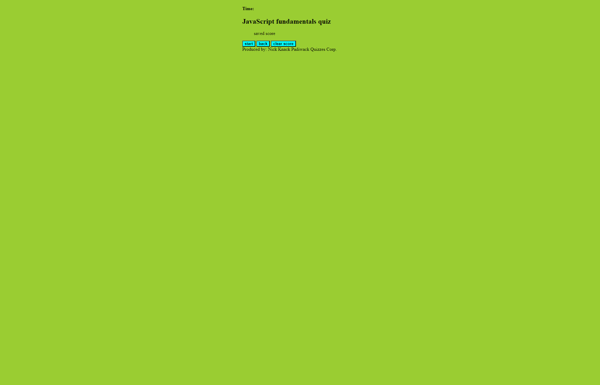

# Web-API-Code-Quiz
A timed quiz app that stores high scores

## Description

Provide a short description explaining the what, why, and how of your project. Use the following questions as a guide:
This page is for testing users JavaScript fundamentals. This is accomplished by providing the user with questions pertaining to JavaScript and having the user click the given answers until the quiz is finished.

## Installation

N/A

## Usage

This page is used by clicking the start game button and answering the questions by clicking the appropriate answer buttons.

Screenshot:

Deployed URL: https://nick-jda.github.io/Web-API-Code-Quiz/

---
